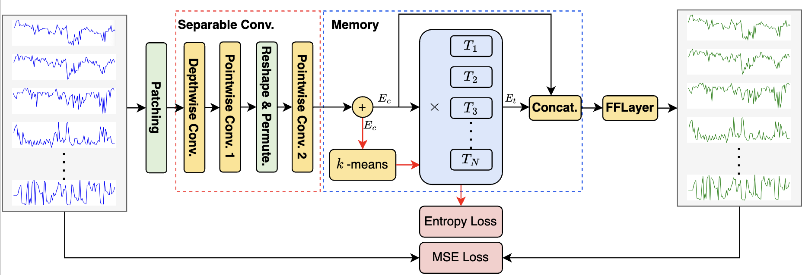

# Memory-guided-Separable-Convolution-Network

## Abstract
Multivariate time series anomaly detection plays a crucial role in many fields, such as industrial monitoring, finance, and healthcare. Traditional methods often fall short in capturing the intricate relationships among variables, leading to a higher likelihood of false positives and missed anomalies. Recent deep models exhibit superior performance, whereas are unsuitable for online deployment. In this paper, a lightweight convolution neural network is designed. Only a single separable convolution layer is adopted to capture the inter-dependencies across different variables and different timestamps. Moreover, a memory block, in which the prototypes of the historical time subsequences are maintained, is introduced to assist the sequence reconstruction. In order to integrate the memory block into the convolution network, a novel two-round training strategy is proposed. The first round focuses on optimizing the time series reconstruction, while the second round allows the prototypes in the memory block to be adaptive to the recent normal status. Such design demonstrates superior performance while maintaining the model simplicity, which allows it to be easily deployed online. Comprehensive experiments conducted on three popular benchmarks confirm its effectiveness as well as its efficiency.

## Acknowledgement

We appreciate the following github repos a lot for their valuable code base or datasets:

https://github.com/ts-kim/RevIN

https://github.com/luodhhh/ModernTCN

https://github.com/thuml/Time-Series-Library

https://github.com/gunny97/MEMTO
